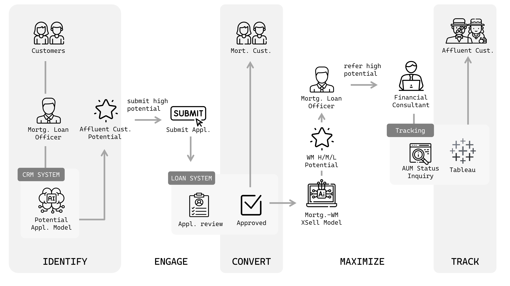

##  💡 Cross-sell Investment Products to Mortgage Clients

## 📝 Overview
This data-driven strategy integrates two predictive models, a Tableau dashboard, and an automated mail system within the Customer Value Optimization (CVO) framework.
The five stages of CVO are:
1. **Identify**: Embedded a real-time investment propensity model in the CRM system to help loan officers recognize high-potential customers.
2. **Engage**: Focused on customers with a high likelihood of becoming affluent and guided them through application journey.
3. **Convert**: After mortgage approval, deployed a second model leveraging application data to predict affluent potential, enabling prioritized follow-ups and timely referrals to financial consultants.
4. **Maximize**: Automated the delivery of model outputs and integrated them into frontline workflows, ensuring financial consultants focus on customers with the highest potential value.
5. **Track**: Built a Tableau dashboard to monitor lead conversion, frontline performance, and client asset growth, creating a continuous improvement loop. Frontline teams can also retrieve clients’ asset status directly from the CRM system.
##

## 📂 Files
**SQL_feature_engineering**  
This code snippet includes several highligts of SQL techniques:
1. Use the UNPIVOT operation to convert columns into rows for subsequent left-joined feature creation
2. Retrieve previous period values within each case sequence
3. Use prime numbers to group text categories (e.g. District)
4. Use WHILE loop to generates a sequence of monthly periods by iterating backward in time from the current month
5. Use WINDOW FUNCTION to compute 1-, 3-, and 6-month rolling transaction sums

**Python_model_training**  
This code snippet covers the process of building a model:
1. Retrieving data from a database
2. Splitting the data into training, validation, and test sets
3. Training segment-specific XGBoost models with Optuna for hyperparameter tuning
4. Explaining model predictions using SHAP
5. Evaluating model performance with metrics like F1, ROC-AUC, and PR-AUC
6. Creating binners for production use
7. Saving and loading trained models for deployment

