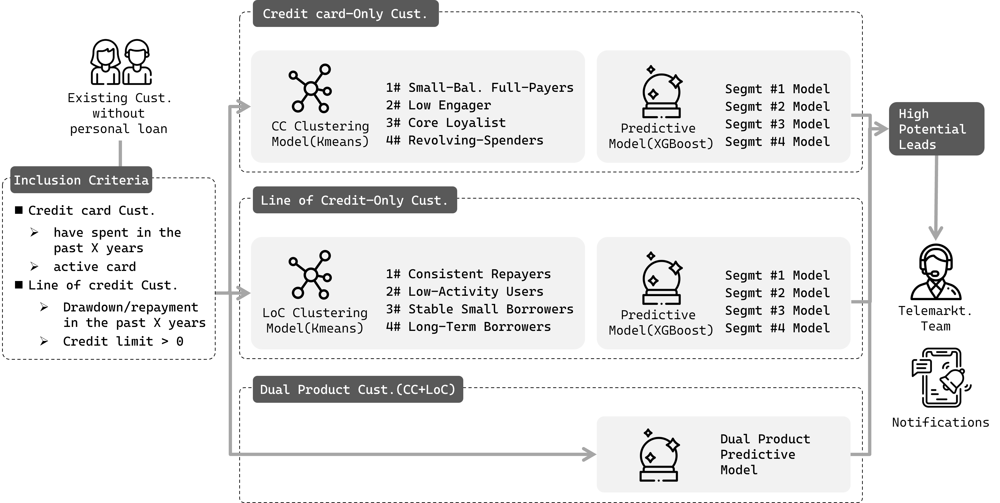

#  💡 Multi-Model Cross-Selling Engine for Personal Loan Offer

## 📝 Overview
This Cross-Selling Engine integrates two product-specific K-Means clustering models and nine segment-specific XGBoost classifiers to identify high-potential leads for personal loan offers. Existing customers are first segmented into nine groups based on their product holdings and transaction behaviors. Within each segment, a dedicated XGBoost model predicts customers with a high likelihood of taking a personal loan. The resulting leads are prioritized for telemarketing outreach and targeted through personalized notifications in the mobile banking app to maximize conversion rates.
##

## 📂 Files
- **SQL_feature_engineering** 
This code snippet includes:
1. Matching future target labels to customers at specific months 
2. deriving rolling-window features over 1M, 3M, 6M, and 12M periods

- **Python_model_training** 
This code snippet covers the process of building segment-specific models:
0. Retrieving data from a database.
1. Reducing feature dimensionality using PCA.
2. Clustering samples based on PCA components.
3. Labeling the original dataset with KMeans segments.
4. Splitting the data into training, validation, and test sets.
5. Training segment-specific XGBoost models with Optuna for hyperparameter tuning.
6. Explaining model predictions using SHAP.
7. Evaluating model performance with metrics like F1, ROC-AUC, and PR-AUC.
8. Creating binners for production use.
9. Saving and loading trained models for deployment.

